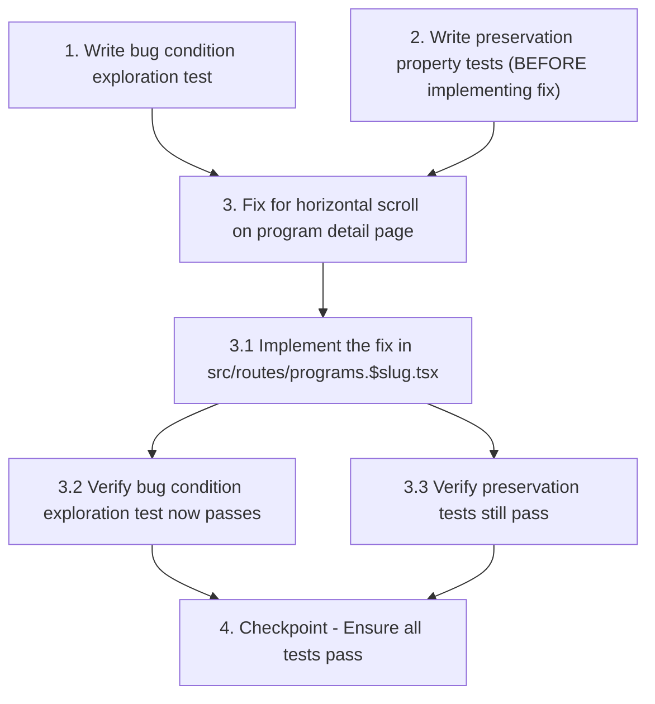

# Implementation Plan

## Overview

This task list implements the horizontal scroll bugfix for the programs section following the bugfix workflow methodology. The approach uses property-based testing to validate both the fix and preservation of existing behavior.

## Tasks

- [ ] 1. Write bug condition exploration test
  - **Property 1: Bug Condition** - No Horizontal Scroll on Program Detail Page
  - **CRITICAL**: This test MUST FAIL on unfixed code - failure confirms the bug exists
  - **DO NOT attempt to fix the test or the code when it fails**
  - **NOTE**: This test encodes the expected behavior - it will validate the fix when it passes after implementation
  - **GOAL**: Surface counterexamples that demonstrate the horizontal scroll bug exists
  - **Scoped PBT Approach**: Test program detail page at specific viewport widths [375, 768, 1024, 1366, 1920, 2560, 3440]
  - Test that for the route `/programs/$slug`, `document.body.scrollWidth <= window.innerWidth` for all viewport widths (from Bug Condition in design)
  - The test assertions should verify no horizontal scrollbar appears: `page.hasHorizontalScrollbar == false`
  - Run test on UNFIXED code
  - **EXPECTED OUTCOME**: Test FAILS (this is correct - it proves the bug exists)
  - Document counterexamples found: viewport widths where `scrollWidth > innerWidth` (expected: desktop 1366px, 1920px)
  - Measure cover image section width vs viewport width
  - Check if syllabus grid contributes to overflow
  - Mark task complete when test is written, run, and failure is documented
  - _Requirements: 1.1, 1.2, 1.3, 1.4_

- [ ] 2. Write preservation property tests (BEFORE implementing fix)
  - **Property 2: Preservation** - Program Listing and Other Pages Layout
  - **IMPORTANT**: Follow observation-first methodology
  - Observe behavior on UNFIXED code for non-buggy routes ["/programs", "/", "/pricing", "/about"]
  - Observe: program listing page at `/programs` displays grid correctly without horizontal scroll
  - Observe: responsive breakpoints (`md:grid-cols-2`, `lg:grid-cols-3`) apply correctly on listing page
  - Observe: program card images maintain `aspect-[4/5]` ratio with grayscale hover effects
  - Observe: sticky sidebar on program detail page positions correctly at `lg:top-32`
  - Observe: header and footer render with expected layout
  - Observe: syllabus hover effects (`hover:bg-card/50`, `group-hover:italic`) work correctly
  - Write property-based tests capturing observed behavior patterns from Preservation Requirements
  - Test cases should verify layout dimensions, DOM structure, and visual properties remain unchanged
  - Property-based testing generates many test cases for stronger guarantees across viewport widths
  - Run tests on UNFIXED code
  - **EXPECTED OUTCOME**: Tests PASS (this confirms baseline behavior to preserve)
  - Mark task complete when tests are written, run, and passing on unfixed code
  - _Requirements: 3.1, 3.2, 3.3, 3.4, 3.5, 3.6_

- [ ] 3. Fix for horizontal scroll on program detail page

  - [ ] 3.1 Implement the fix in `src/routes/programs.$slug.tsx`
    - Add viewport constraints to cover image section:
      - Wrap cover image `ScrollReveal` with container having `max-w-full overflow-hidden`
      - Ensure cover image section has `w-full` class to respect viewport boundaries
      - Consider reducing `aspect-[21/9]` to `aspect-[16/9]` or `aspect-video` for better viewport fit
    - Add overflow prevention to main page container:
      - Apply `overflow-x-hidden` to outermost `<div className="min-h-screen bg-background">` or main element
      - Ensure all full-width sections outside `max-w-[1400px]` container have proper overflow handling
    - Optimize container padding for smaller viewports:
      - Change `px-6` to responsive `px-4 md:px-6` on containers to reduce padding on mobile
    - Review syllabus grid layout:
      - Verify `grid-cols-[60px_1fr_auto]` doesn't cause overflow
      - Add `min-w-0` to grid items if needed to allow text truncation
    - _Bug_Condition: isBugCondition(input) where input.route == "/programs/$slug" AND input.documentWidth > input.viewportWidth_
    - _Expected_Behavior: For all viewport widths, document.body.scrollWidth <= window.innerWidth AND page.hasHorizontalScrollbar == false_
    - _Preservation: Program listing page layout, responsive breakpoints, image aspect ratios, sticky sidebar positioning, header/footer display, and hover effects remain unchanged_
    - _Requirements: 1.1, 1.2, 1.3, 1.4, 2.1, 2.2, 2.3, 2.4, 3.1, 3.2, 3.3, 3.4, 3.5, 3.6_

  - [ ] 3.2 Verify bug condition exploration test now passes
    - **Property 1: Expected Behavior** - No Horizontal Scroll on Program Detail Page
    - **IMPORTANT**: Re-run the SAME test from task 1 - do NOT write a new test
    - The test from task 1 encodes the expected behavior
    - When this test passes, it confirms the expected behavior is satisfied
    - Run bug condition exploration test from step 1
    - **EXPECTED OUTCOME**: Test PASSES (confirms bug is fixed)
    - Verify at all tested viewport widths [375, 768, 1024, 1366, 1920, 2560, 3440]:
      - `document.body.scrollWidth <= window.innerWidth`
      - No horizontal scrollbar appears
      - Cover image fits within viewport
      - Syllabus grid doesn't overflow
    - _Requirements: 2.1, 2.2, 2.3, 2.4_

  - [ ] 3.3 Verify preservation tests still pass
    - **Property 2: Preservation** - Program Listing and Other Pages Layout
    - **IMPORTANT**: Re-run the SAME tests from task 2 - do NOT write new tests
    - Run preservation property tests from step 2
    - **EXPECTED OUTCOME**: Tests PASS (confirms no regressions)
    - Confirm all preservation tests still pass after fix:
      - Program listing page `/programs` layout unchanged
      - Responsive breakpoints still apply correctly
      - Image aspect ratios and hover effects preserved
      - Sticky sidebar positioning unchanged
      - Header and footer render identically
      - Syllabus hover effects work correctly
    - _Requirements: 3.1, 3.2, 3.3, 3.4, 3.5, 3.6_

- [ ] 4. Checkpoint - Ensure all tests pass
  - Ensure all tests pass, ask the user if questions arise.
  - Bug condition test (Property 1) should now PASS - horizontal scroll eliminated
  - Preservation tests (Property 2) should still PASS - no regressions on other pages
  - Manually verify program detail page at various viewport widths (desktop, tablet, mobile)
  - Manually verify program listing page layout unchanged
  - If any tests fail, investigate root cause and iterate on the fix

## Task Dependency Graph

```json
{
  "waves": [
    {
      "wave": 1,
      "tasks": ["1", "2"],
      "description": "Write exploration and preservation tests on UNFIXED code"
    },
    {
      "wave": 2,
      "tasks": ["3.1"],
      "description": "Implement the fix"
    },
    {
      "wave": 3,
      "tasks": ["3.2", "3.3"],
      "description": "Verify fix and preservation"
    },
    {
      "wave": 4,
      "tasks": ["4"],
      "description": "Final checkpoint"
    }
  ]
}
```



## Notes

- Task 1 must FAIL on unfixed code - this confirms the bug exists
- Task 2 must PASS on unfixed code - this establishes baseline behavior to preserve
- After implementing the fix in task 3.1, task 1 should PASS (bug fixed) and task 2 should still PASS (no regressions)
